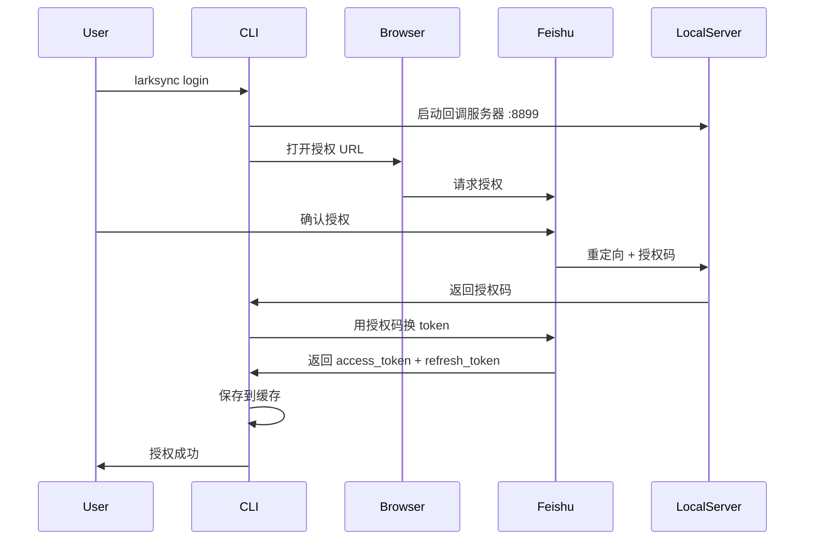
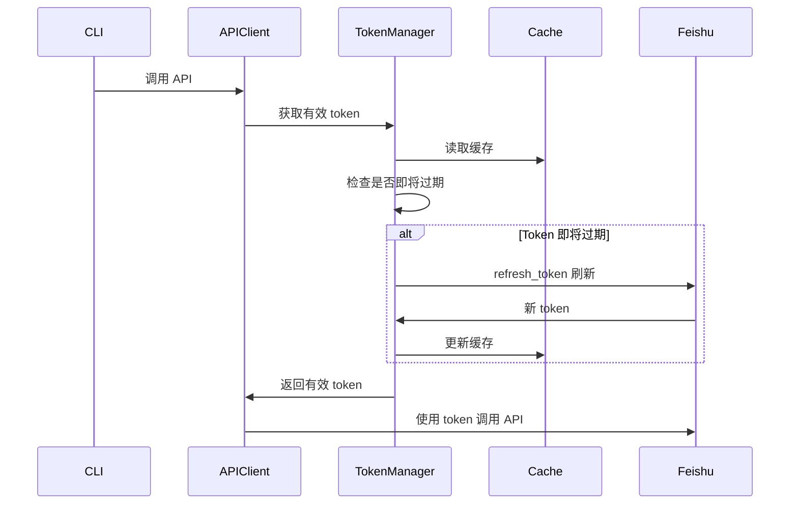

# CLI OAuth 授权功能使用指南

## 功能概述

LarkSync 命令行工具现在支持完整的 OAuth 授权流程，提供自动化的 token 管理功能：

✅ **浏览器自动授权** - 自动打开浏览器跳转到飞书授权页面  
✅ **Token 自动刷新** - API 调用前自动检测并刷新即将过期的 token  
✅ **安全缓存** - Token 安全保存在本地，下次运行直接使用  
✅ **无缝体验** - 整个过程对用户透明，无需手动干预  

## 快速开始

### 1. 配置应用凭证

在 `config.toml` 中配置飞书应用的 app_id 和 app_secret：

```toml
[auth]
app_id = "cli_a6xxxxxxxxxxxxxx"
app_secret = "xxxxxxxxxxxxxxxxxxxxxx"

# 可选：配置回调地址（默认为 http://localhost:8899/callback）
oauth_callback_url = "http://192.168.10.35:8899/callback"

# 可选：使用共享回调服务（默认回调路径 /cli/oauth/callback）
# oauth_service_base_url = "https://oauth.example.com"
```

> **获取应用凭证**：
> 1. 访问 [飞书开放平台](https://open.feishu.cn/app)
> 2. 创建或选择一个应用
> 3. 在“凭证与基础信息”中获取 App ID 和 App Secret
> 4. 在“安全设置 > 重定向URL”中添加：
>    - 默认：`http://localhost:8899/callback`
>    - 或你配置的回调地址（如 `http://192.168.10.35:8899/callback`）

### 2. 首次授权

运行登录命令：

```bash
larksync login
```

系统会自动：
1. 打开默认浏览器
2. 跳转到飞书授权页面
3. 等待你完成授权
4. 自动获取并保存 token

**示例输出：**
```
🔐 正在打开浏览器进行飞书授权...
授权 URL: https://passport.feishu.cn/suite/passport/oauth/authorize?...
⏳ 等待授权完成...
✅ 授权码已获取，正在换取访问令牌...
✅ 访问令牌获取成功！(有效期: 7200秒)
✨ Token 已保存到 /home/user/.larksync/token_cache.json
```

### 3. 使用自动刷新

配置完成后，所有命令都会自动使用缓存的 token，无需手动操作：

```bash
# 下载文档（自动使用缓存 token，如需刷新会自动处理）
larksync download --type docx doccnxxxxxx

# 同步空间
larksync sync-space --limit 50
```

## 共享回调服务模式

当需要为多台机器或无人值守环境提供统一的授权入口时，可以部署共享的 OAuth 回调服务。自 v1.4 起，只要在配置中启用了 `[web]` 并设置 `web.oauth.base_url`，CLI 会自动复用该服务完成授权，无需额外指定 `auth.oauth_service_base_url`。

1. **部署服务端**  
   使用 `uvicorn` 启动 `larksync.web.app:create_app`（或通过项目中的 `scripts/start_dev.sh`），并在飞书开放平台为该服务配置重定向 URL（建议使用 `/cli/oauth/callback`）。

2. **配置 CLI**  
   - 默认情况下，`auth.oauth_service_base_url` 会继承 `web.oauth.base_url`。确保后端服务可从 CLI 机器访问。
   - 如需覆盖，可在 `config.toml` 中显式设置：
     ```toml
     [auth]
     app_id = "..."
     app_secret = "..."
     oauth_service_base_url = "https://oauth.example.com"
     ```

3. **授权体验**  
   CLI 会向共享服务请求授权会话并轮询结果，整个过程与本地模式一致，但无需再在每台机器上启动回调 Web 服务。同一服务端可同时处理多个 CLI 会话。

## 命令详解

### `larksync login`
**功能**: 通过浏览器进行飞书 OAuth 授权

**使用场景**:
- 首次使用时进行授权
- Token 过期后重新授权
- 切换账号

**流程**:
1. 生成授权 URL 并在浏览器中打开
2. 未配置共享服务时，CLI 会启动本地回调服务器（监听 localhost:8899）；否则改为向共享服务请求会话
3. 用户在浏览器中完成授权
4. 接收授权码并换取 access_token
5. 保存 token 到 `~/.larksync/token_cache.json`

**示例**:
```bash
larksync login

# 使用自定义配置文件
larksync login --config /path/to/config.toml
```

---

### `larksync token-status`
**功能**: 查看当前 token 状态

**输出信息**:
- Token 状态（有效/即将过期/已过期）
- 过期时间
- 缓存位置

**示例输出**:
```
============================================================
Token 状态
============================================================
状态: Token 有效 (剩余 1 小时)
过期时间: 2025-10-26T10:30:00.000000+00:00
更新时间: 2025-10-26T08:30:00.000000+00:00
缓存位置: /home/user/.larksync/token_cache.json
============================================================
```

---

### `larksync refresh-token`
**功能**: 手动刷新 access token

**使用场景**:
- 想要主动刷新 token
- 测试刷新功能
- 在长时间运行前确保 token 有效

**示例**:
```bash
larksync refresh-token

# 输出：
# 🔄 正在刷新 token...
# ✅ Token 刷新成功！
# Access Token: new_access_token_123...
# 有效期: 7200 秒 (2 小时)
```

---

### `larksync logout`
**功能**: 清除本地缓存的 token

**使用场景**:
- 退出登录
- 清理敏感数据
- 切换账号前

**示例**:
```bash
larksync logout

# 输出：
# ✅ 已清除本地 token 缓存
```

## 自动 Token 刷新机制

### 工作原理

1. **API 调用前检查**: 每次调用飞书 API 前，系统会检查 token 是否即将过期
2. **过期判断**: 如果 token 在 10 分钟内过期，触发自动刷新
3. **静默刷新**: 使用 refresh_token 向飞书请求新的 token
4. **更新缓存**: 刷新成功后，更新内存和缓存文件中的 token
5. **继续执行**: 使用新 token 继续原始请求

### Token 优先级

系统按以下优先级获取 token：

1. **配置文件中的 user_access_token**（向后兼容，不自动刷新）
   ```toml
   [auth]
   user_access_token = "u-xxxxxx"
   ```

2. **缓存文件中的 token**（自动刷新）
   - 位置: `~/.larksync/token_cache.json`
   - 内容: access_token, refresh_token, expires_at

3. **OAuth 授权获取**（首次使用或缓存失效）
   - 需要配置 app_id 和 app_secret

### 刷新失败处理

如果 refresh_token 也失效（如过期、被撤销），系统会：
1. 记录警告日志
2. 提示用户重新授权
3. 建议运行 `larksync login`

## 配置示例

### 完整配置（推荐）

```toml
[auth]
# OAuth 应用凭证（用于自动授权和刷新）
app_id = "cli_a6xxxxxxxxxxxxxx"
app_secret = "your_app_secret_here"

# 回调地址（可选）
# 默认: http://localhost:8899/callback
# 远程访问或内网环境可配置为内网 IP:
oauth_callback_url = "http://192.168.10.35:8899/callback"

# 可选：直接指定 user_access_token（跳过 OAuth）
# user_access_token = "u-xxxxxxxxxxxxxx"

[storage]
root = "./output"

[logging]
level = "INFO"
```

### 最小配置（OAuth 模式）

```toml
[auth]
app_id = "cli_a6xxxxxxxxxxxxxx"
app_secret = "your_app_secret_here"
```

### 兼容模式（直接使用 token）

```toml
[auth]
user_access_token = "u-xxxxxxxxxxxxxx"
```

## Token 缓存

### 缓存位置

- **Linux/Mac**: `~/.larksync/token_cache.json`
- **Windows**: `%USERPROFILE%\.larksync\token_cache.json`

### 缓存内容

```json
{
  "access_token": "u-xxxxxxxxxxxxxx",
  "refresh_token": "ur-xxxxxxxxxxxxxx",
  "expires_at": "2025-10-26T10:30:00.000000+00:00",
  "updated_at": "2025-10-26T08:30:00.000000+00:00"
}
```

### 安全建议

⚠️ **注意**：缓存文件包含敏感的访问令牌，请注意：

1. **文件权限**: 确保缓存文件只有你的用户可以读取
2. **不要提交**: 不要将缓存文件提交到版本控制系统
3. **及时清理**: 使用 `larksync logout` 清除不用的 token

## 常见问题

### Q: 浏览器没有自动打开怎么办？

A: 命令行会输出授权 URL，手动复制到浏览器中打开即可：
```
授权 URL: https://passport.feishu.cn/suite/passport/oauth/authorize?...
如果浏览器未自动打开，请手动复制上述链接到浏览器中
```

### Q: 授权超时怎么办？

A: 默认等待 2 分钟。如果超时，请：
1. 检查网络连接
2. 重新运行 `larksync login`
3. 确保端口 8899 未被占用

### Q: 如何配置自定义回调地址？

A: 在 `config.toml` 中添加 `oauth_callback_url` 配置：

```toml
[auth]
app_id = "your_app_id"
app_secret = "your_app_secret"
oauth_callback_url = "http://192.168.10.35:8899/callback"
```

**使用场景**：
- 内网环境：`http://192.168.x.x:8899/callback`
- 公网 IP：`http://your-public-ip:8899/callback`
- 自定义端口：`http://localhost:9000/callback`

**注意**：
1. 回调地址必须在飞书应用后台「安全设置 > 重定向URL」中配置
2. 服务器需要能够监听该 IP 和端口
3. 浏览器需要能够访问该地址

### Q: 提示"refresh_token 已过期"怎么办？

A: Refresh token 也有过期时间（通常 30 天）。过期后需要重新授权：
```bash
larksync login
```

### Q: 如何在多台机器上使用？

A: 两种方式：

**方式 1**: 每台机器独立授权
```bash
# 在每台机器上运行
larksync login
```

**方式 2**: 复制缓存文件
```bash
# 从机器 A 复制到机器 B
scp ~/.larksync/token_cache.json user@machineB:~/.larksync/
```

### Q: Token 什么时候会自动刷新？

A: 当满足以下条件时自动刷新：
- Token 有效期 < 10 分钟
- 有有效的 refresh_token
- 配置了 app_id 和 app_secret

### Q: 可以禁用自动刷新吗？

A: 直接在配置中使用 `user_access_token` 即可禁用：
```toml
[auth]
user_access_token = "u-xxxxxx"  # 直接指定，不会自动刷新
```

## 技术细节

### OAuth 流程



### Token 刷新流程



## 版本历史

- **v0.2.0** (2025-10-26)
  - ✨ 新增 CLI OAuth 授权支持
  - ✨ 新增自动 token 刷新机制
  - ✨ 新增 login/logout/token-status/refresh-token 命令
  - 🔒 Token 安全缓存到本地文件

## 相关文档

- [项目 README](../README.md)
- [配置说明](../config.sample.toml)
- [Token 刷新测试报告](../tests/CLI_TOKEN_REFRESH_TEST_REPORT.md)
- [飞书开放平台文档](https://open.feishu.cn/document)

---

**需要帮助？** 请提交 Issue 或查看项目文档。
